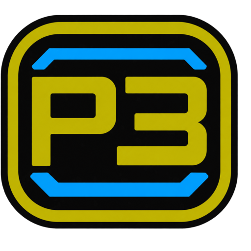

<p align="center">
  
</p>

<h1 align="center">P3</h1>

<p align="center"><strong>T3 Code for Pebble.</strong> Watch and steer your coding agents from your wrist.</p>

<p align="center">
  <a href="https://github.com/breakthebeta/p3code/actions/workflows/ci.yml"></a>
  
  
</p>

Drive [T3 Code](https://github.com/pingdotgg/t3code) session threads from a
Pebble Time 2 over your own tailnet. The watch side is an ordinary Pebble C app;
the PebbleKit JS bridge on the phone talks directly to T3 Code's REST
orchestration API. There is no intermediate bridge process, no fork of T3 Code,
and no server-side patching — it runs on top of the published `t3` command-line
tool (verified against `t3@0.0.33`). Live model information and pull request
metadata come over stock T3's authenticated WebSocket RPC.

| Host overview | Active threads | Thread detail |
| --- | --- | --- |
|  |  |  |

## Quick start

### 1. Install the watch app on your Pebble

Clone the repo and build `dist/p3.pbw` yourself:

```sh
git clone https://github.com/breakthebeta/p3code.git
cd p3code
./verify-p3.sh
```

That writes the installable bundle to `dist/p3.pbw`. Install it with the Pebble
toolchain or the Core Devices / Pebble phone app. The build needs the Pebble SDK
on your `PATH` — check with `pebble --version`.

### 2. Run the launcher script on the machine running T3 Code

You need Node.js 22.16+, 23.11+, or 24.10+, plus `t3`, `tailscale`, and `curl`:

```sh
npm install -g t3
brew install tailscale   # or your platform's package manager

curl -fsSL https://raw.githubusercontent.com/breakthebeta/p3code/main/run-p3-tailscale.sh \
  | P3_TAILSCALE_SERVE=1 bash
```

No checkout is needed on that machine — the script fetches the helper files it
depends on. If you already have a clone, `./run-p3-tailscale.sh` behaves exactly
the same. To pin a version instead of tracking `main`, set
`P3_REF=<tag or sha>`.

### 3. Paste the line it prints into the watch app settings

The script binds T3 Code to your tailnet, issues a long-lived bearer token, and
then prints a single configuration line:

```text
p3code1|beta1|https://beta1.tailnet.ts.net|<token>
```

Open settings in the phone app, paste the line under **Quick setup**, and press
**Add from paste**.

Run the script on every machine you want to reach, then paste each line in —
together or one at a time. Pasting a machine's line again refreshes its token in
place rather than adding a duplicate, so when a token expires, running the script
again is enough. You can configure up to 6 machines; each takes one row on the
watch, they are queried in parallel, and a sleeping machine shows as `offline`
without holding up the others.

## Controls

**Host screen** — one row per machine, with its thread counts.

| | |
| --- | --- |
| Up / Down | Move between machines |
| Select | Open that machine's threads |
| Long-press Select | Diagnostics — failures are logged on the watch instead of flashing an error at you |


**Thread list** — pinned threads first, then the rest: running, waiting, errored.

| | |
| --- | --- |
| Up / Down | Move between threads |
| Select | Open the thread |
| Long-press Select on a thread | Thread actions — Reply, Settle, and Interrupt for active threads; Unsettle for settled ones; Pin or Unpin for any |
| Select on a project | Pick a model, then dictate the first prompt of a new thread |
| Long-press Select on a project | Open the cancel-first project delete menu |
| Last row | Switch scope: `SETTLED 34` goes to the settled list, `ACTIVE 6` returns to the active list. A `MORE 20 OF 34` row fetches the next page. |

| Active thread list | Thread actions | Settled thread list |
| --- | --- | --- |
|  |  |  |

**Thread detail** — title, project path, provider, status, and the latest
summary.

| | |
| --- | --- |
| Select | Dictate a reply by voice |
| Down | The full transcript, one page at a time |
| Back | Return to the list |

| Summary | Transcript |
| --- | --- |
|  |  |

Dictating `stop`, `interrupt`, or `cancel turn` interrupts the turn in progress.
Approval requests and user-input requests from T3 Code are answered the same way.

Pinned threads lead the active list in T3's own order, under their own
**PINNED** heading and each marked with a pushpin; the headings appear only when
something is actually pinned. Pin and Unpin are in the thread action menu, and
pinning is also the quickest way out of the settled list, because T3 reopens a
thread it pins. Ordinary active threads stay sorted newest-first by creation
time and do not jump to the top just because an agent replied. Settled history is ordered by most recently finished. A thread
settles after a configured quiet window (three days by default), when its PR
closes, or when it is merged if settle-on-merge is enabled. An open PR still
counts as active, matching T3 Code's sidebar. T3's background **Monitoring**
state is clearly distinguished from idle in both the thread rows and the host
counts; it stays quiet rather than pulsing like a thread that is really working.
On the host overview, each small block stands for one thread, up to 14 of them;
monitoring blocks are green and idle blocks use dark LCD ink. Past that cap, the
fraction beside them still carries the exact numbers.

### Offline hosts and diagnostics

An offline host gets the whole overview panel to explain why it failed; SELECT
then retries instead of opening an empty thread list. Long-pressing SELECT on any
healthy host opens diagnostics, which keeps recent failures along with sync,
battery, frame rate, and message counts.

| Offline host | Diagnostics |
| --- | --- |
|  |  |

## Creating a project from the watch

Pick `New project` in the project list and dictate a name. The phone resolves it
to an absolute path and shows it; nothing is created until you confirm. A
**Project root** configured in settings takes priority; otherwise the bridge uses
the common parent of your existing projects, or, on a brand-new server, T3's
startup directory:

```text
"sparkle renderer"  ->  /home/will/Projects/sparkle-renderer
```

The confirmation menu rests on **Cancel** by default, because dictation can
mishear you; you have to pick **Create** explicitly before it dispatches
`project.create` with `createWorkspaceRootIfMissing` to make the directory for
you.

Long-pressing **Select** on the same row speaks the location out loud instead. A
**concierge project** named in settings lets its agent work out the path and
propose one. The agent only proposes — the watch still waits for your approval
before creating anything, so that confirmation is always a real gate.

To delete a project, highlight it and long-press **Select**. The delete menu also
rests on **Cancel**; move down to **Delete project** and select it deliberately.
T3 removes the project along with all of its threads, but it does not delete the
checkout on disk.

| Project list | Create confirmation | Delete menu |
| --- | --- | --- |
|  |  |  |

## Reference

- [docs/tailscale.md](docs/tailscale.md) — environment variables for the launcher
  script, Tailscale Serve mode, and the `tailscale is required` snag on macOS.
- [docs/t3code-compatibility.md](docs/t3code-compatibility.md) — the exact
  surface of the T3 Code API this project depends on.

Settings can also be filled in by hand instead of pasted:

```text
Base URL:     http://<tailscale-ip>:3773
Access token: <token issued by t3 auth session issue>
```

To issue one directly:

```sh
t3 auth session issue --ttl 365d --label "P3 watch" --token-only
```

List tokens with `t3 auth session list` and revoke them with
`t3 auth session revoke <session-id>`.

## Development

This repo is deliberately small:

```text
p3/                         Pebble C app and PebbleKit JS bridge
lib/                        shared T3 CLI and Tailscale helpers
docs/                       compatibility notes and emulator screenshots
run-p3-tailscale.sh         launcher used on each T3 host
verify-p3.sh                full build and real-server smoke test
capture-p3-screenshots.sh   deterministic emery screenshot rig
```

The fast phone-bridge tests:

```sh
cd p3
node --check src/pkjs/index.js
node test/bridge.test.js
node test/bridge.integration.test.js
```

Full local verification, including the Pebble build and a smoke test against a
real stock T3 Code server:

```sh
./verify-p3.sh
```

The smoke test starts `t3 serve` on a throwaway data directory, checks that
`/api/orchestration/snapshot` rejects unauthenticated reads, and then checks that
it answers requests carrying a bearer token.

Screenshots are captured from the emery emulator:

```sh
./capture-p3-screenshots.sh
```

It builds an isolated copy with `SCREENSHOT_FIXTURES` forced on, keeps a single
native emery emulator alive from start to finish through the whole deterministic
storyboard, and updates the eleven committed PNGs in `docs/screenshots/`. It
grabs the running QEMU framebuffer directly, so Pebble Tool 5.x cannot quietly
attach a fresh emulator with no app installed. The script needs native `pebble`,
Python 3, netcat, and ImageMagick.
